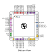

# Pinout

The chip is packaged in a 64-pin QFN package. The pinout is shown below.

Note: you will receive the chip mounted on a [breakout board](https://github.com/TinyTapeout/caravel-breakout-pcb/tree/main/breakout-qfn). The pinout is provided for advanced users, as most users will not need to solder the chip directly.
